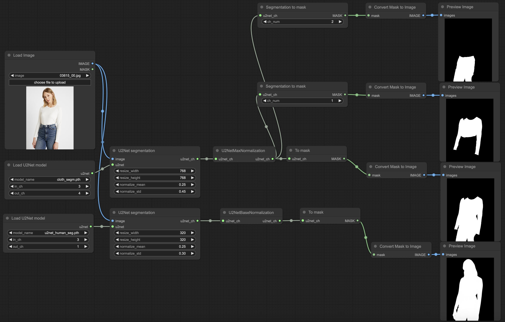

# U2NET for ComfyUI

# Installation
Clone the repo `git clone https://github.com/ProDALOR/comfyui_u2net.git` into ComfyUI folder `custom_nodes/`.

# Usage example

# Models
Put into ComfyUI folder `models/u2net`
- [Cloth segmentation](https://github.com/levindabhi/cloth-segmentation) - [cloth_segm.pth](https://drive.google.com/uc?id=11xTBALOeUkyuaK3l60CpkYHLTmv7k3dY)
- [Human segmentation](https://github.com/xuebinqin/U-2-Net) - [u2net_human_seg.pth](https://drive.google.com/uc?id=1-Yg0cxgrNhHP-016FPdp902BR-kSsA4P)